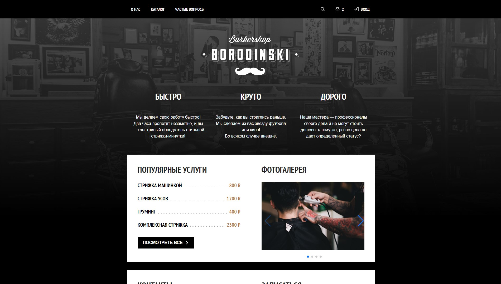

# Borodinski

<div align="center">
  

  <h3 align="center">Modern Barbershop Website</h3>

  <p align="center">
    A stylish and feature-rich website template for barbershops and hair salons
    <br />
    <a href="https://procodezero.github.io/Borodinski/"><strong>View Demo »</strong></a>
    <br />
    <br />
    <a href="https://github.com/ProCodeZero/Borodinski/issues">Report Bug</a>
    ·
    <a href="https://github.com/ProCodeZero/Borodinski/issues">Request Feature</a>
  </p>
</div>

## About The Project

Borodinski is a modern website template designed specifically for barbershops and hair salons. It provides a complete web presence solution including service showcases, an interactive gallery, online shop functionality, and customer interaction features.

## Built With

[![HTML5][HTML5]][HTML-url]
[![CSS3][CSS3]][CSS-url]
[![SCSS][SCSS]][SCSS-url]
[![JavaScript][JavaScript]][JavaScript-url]
[![Swiper][Swiper.js]][Swiper-url]

[HTML5]: https://img.shields.io/badge/HTML5-E34F26?style=for-the-badge&logo=html5&logoColor=white
[HTML-url]: https://html.spec.whatwg.org/
[CSS3]: https://img.shields.io/badge/CSS3-1572B6?style=for-the-badge&logo=css3&logoColor=white
[CSS-url]: https://www.w3.org/Style/CSS/
[SCSS]: https://img.shields.io/badge/Sass-CC6699?style=for-the-badge&logo=sass&logoColor=white
[SCSS-url]: https://sass-lang.com/
[JavaScript]: https://img.shields.io/badge/JavaScript-F7DF1E?style=for-the-badge&logo=javascript&logoColor=black
[JavaScript-url]: https://developer.mozilla.org/en-US/docs/Web/JavaScript
[Swiper.js]: https://img.shields.io/badge/Swiper.js-6332F6?style=for-the-badge&logo=swiper&logoColor=white
[Swiper-url]: https://swiperjs.com/

## Getting Started

To get a local copy up and running, follow these simple steps.

### Prerequisites

- A modern web browser
- Basic understanding of HTML/CSS/JavaScript
- SCSS compiler (optional, for style modifications)

### Installation

1. Clone the repository:
   ```sh
   git clone https://github.com/ProCodeZero/Borodinski.git
   ```
2. Navigate to the project directory:
   ```sh
   cd Borodinski
   ```
3. Open `index.html` in your web browser to view the website locally.

## Project Structure

```
├── css/              # Compiled CSS files
├── js/              # JavaScript files
├── pictures/        # Images and icons
│   └── icons/      # SVG and other icon files
├── scss/           # SCSS source files
│   ├── _about-us.scss
│   ├── _footer.scss
│   ├── _header.scss
│   ├── _popup.scss
│   ├── _questions.scss
│   ├── _shop.scss
│   └── _zero_style.scss
├── index.html      # Home page
├── about-us.html   # About page
├── shop.html       # Shop/catalog page
└── questions.html  # FAQ page
```

## Features

- Modern and responsive design (desktop only)
- Interactive photo gallery with Swiper.js
- Service catalog with detailed descriptions
- Online shop functionality
- FAQ section
- Contact form
- User authentication popup
- Shopping cart functionality

## How to Use

1. Clone the repository:

   ```bash
   git clone https://github.com/ProCodeZero/Borodinski.git
   ```

2. Open any of the HTML files in a web browser to view the website locally.

3. To modify SCSS:
   - Install a SCSS compiler
   - Watch the SCSS directory
   - Compile to the css/style.css file

## Contributing

Contributions are what make the open source community such an amazing place to learn, inspire, and create. Any contributions you make are **greatly appreciated**.

If you have a suggestion that would make this better, please fork the repo and create a pull request. You can also simply open an issue with the tag "enhancement".

1. Fork the Project
2. Create your Feature Branch (`git checkout -b feature/AmazingFeature`)
3. Commit your Changes (`git commit -m 'Add some AmazingFeature'`)
4. Push to the Branch (`git push origin feature/AmazingFeature`)
5. Open a Pull Request

## Roadmap

- [x] Basic website structure and design
- [x] Interactive gallery implementation
- [x] Shopping cart functionality
- [ ] Mobile responsive design
- [ ] Backend integration
- [ ] Performance optimization
  - [ ] Image optimization
  - [ ] Code splitting
  - [ ] Lazy loading

See the [open issues](https://github.com/ProCodeZero/Borodinski/issues) for a full list of proposed features and known issues.

## License

Distributed under the MIT License. See `LICENSE` for more information.

## Acknowledgments

- [Swiper.js](https://swiperjs.com/) - For the amazing slider functionality
- [Font Awesome](https://fontawesome.com) - For the icons
- [Google Fonts](https://fonts.google.com/) - For the typography
